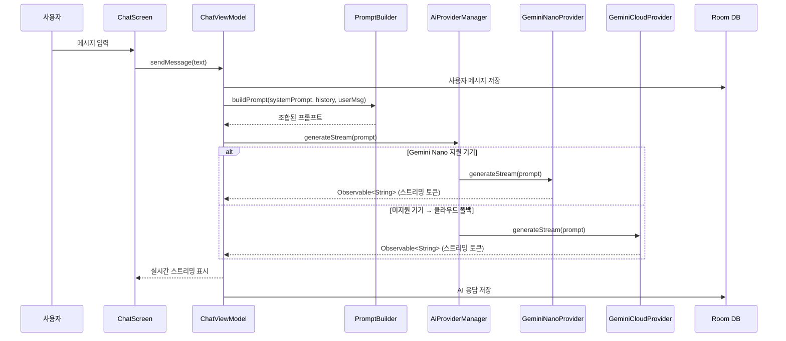
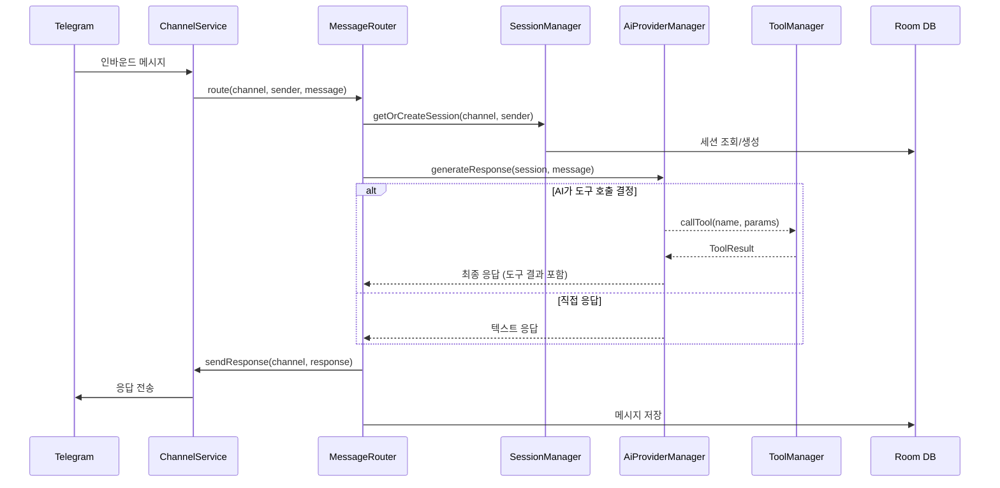
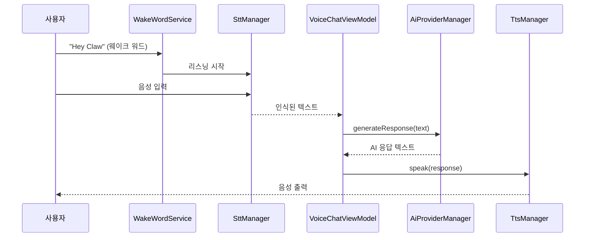

---
tags:
  - 아키텍처
  - 안드로이드
  - Java
  - GeminiNano
관련:
  - "[[03_기술_스택]]"
  - "[[06_AI_프로바이더_설계]]"
---

# 02. 시스템 아키텍처

> **최종 업데이트**: 2026-04

---

## 🗺️ 전체 아키텍처 다이어그램

```mermaid
graph TD
    subgraph 사용자 인터페이스
        ChatUI[채팅 UI]
        VoiceUI[음성 대화 UI]
        Widget[App Widget]
    end

    subgraph Android App — ClawDroid
        UI[XML Views + ViewBinding UI Layer]
        VM[ViewModel Layer]
        
        subgraph Core
            AiMgr[AI Provider Manager]
            ChanMgr[Channel Manager]
            ToolMgr[Tool Manager]
            SessionMgr[Session Manager]
        end

        subgraph AI Providers
            NanoP[Gemini Nano Provider]
            CloudP[Gemini Cloud Provider]
            OpenAIP[OpenAI Provider]
            OllamaP[Ollama Provider]
            CustomP[Custom Provider]
        end

        subgraph Data Layer
            Repo[Repository Layer]
            Room[(Room DB)]
            DataStore[(DataStore)]
            EncPref[(EncryptedPrefs)]
        end

        subgraph Tools
            Browser[Browser Tool]
            Calendar[Calendar Tool]
            Camera[Camera Tool]
            Location[Location Tool]
            MoreTools[... 기타 도구]
        end
    end

    subgraph 온디바이스 AI
        AICore[AICore — Gemini Nano]
        MLKit[ML Kit GenAI APIs]
    end

    subgraph 외부 서비스
        GeminiAPI[Gemini Cloud API]
        OpenAIAPI[OpenAI API]
        OllamaServer[Ollama 로컬 서버]
        TelegramAPI[Telegram Bot API]
        DiscordWS[Discord WebSocket]
        SlackAPI[Slack API]
        GatewayServer[Gateway 서버]
    end

    ChatUI --> UI
    VoiceUI --> UI
    Widget --> UI
    UI --> VM
    VM --> AiMgr
    VM --> ChanMgr
    VM --> ToolMgr
    VM --> SessionMgr
    VM --> Repo

    AiMgr --> NanoP --> AICore
    AiMgr --> CloudP --> GeminiAPI
    AiMgr --> OpenAIP --> OpenAIAPI
    AiMgr --> OllamaP --> OllamaServer
    AiMgr --> CustomP

    ChanMgr --> TelegramAPI
    ChanMgr --> DiscordWS
    ChanMgr --> SlackAPI
    ChanMgr --> GatewayServer

    ToolMgr --> Browser
    ToolMgr --> Calendar
    ToolMgr --> Camera
    ToolMgr --> Location
    ToolMgr --> MoreTools

    Repo --> Room
    Repo --> SharedPref
    Repo --> EncPref

    NanoP --> MLKit
```

---

## 🏛️ 아키텍처 선택: 안드로이드 네이티브 (로컬 퍼스트)

> [!info] 왜 Android 네이티브 + 온디바이스 AI인가?
>
> - **완전한 오프라인 동작**: Gemini Nano로 네트워크 없이 AI 대화 가능
> - **프라이버시**: 대화 데이터가 기기 밖으로 나가지 않음 (온디바이스 모드)
> - **하드웨어 접근**: 카메라, GPS, 연락처, 캘린더 등 Android API 직접 활용
> - **음성 통합**: ML Kit STT, Android TTS, Wake Word 네이티브 지원
> - **Foreground Service**: 채널 연결 상시 유지 가능
> - **Play Store 배포**: 사용자가 쉽게 설치·업데이트

---

## 📦 멀티모듈 프로젝트 구조

```
clawdroid/
├── app/                              # 메인 앱 모듈 (Application, DI, Navigation)
│   └── src/main/
│       ├── java/com/clawdroid/app/
│       │   ├── ClawDroidApp.java         # Application 클래스
│       │   ├── MainActivity.java
│       │   ├── navigation/
│       │   │   └── AppNavGraph.java
│       │   └── di/
│       │       └── AppModule.java        # Hilt 최상위 모듈
│       └── res/
│           ├── layout/
│           │   └── activity_main.xml
│           └── navigation/
│               └── nav_graph.xml
│
├── core/
│   ├── model/                        # 도메인 모델 (순수 Java POJO)
│   │   └── src/main/java/com/clawdroid/core/model/
│   │       ├── Conversation.java
│   │       ├── Message.java
│   │       ├── AiProvider.java
│   │       ├── Channel.java
│   │       ├── Tool.java
│   │       ├── Skill.java
│   │       └── Session.java
│   │
│   ├── data/                         # 데이터 레이어 (Room, Repository, Network)
│   │   └── src/main/java/com/clawdroid/core/data/
│   │       ├── db/
│   │       │   ├── ClawDroidDatabase.java
│   │       │   ├── dao/
│   │       │   │   ├── ConversationDao.java
│   │       │   │   ├── MessageDao.java
│   │       │   │   ├── ChannelDao.java
│   │       │   │   └── ToolDao.java
│   │       │   └── entity/
│   │       │       ├── ConversationEntity.java
│   │       │       ├── MessageEntity.java
│   │       │       ├── ChannelEntity.java
│   │       │       └── ToolEntity.java
│   │       ├── repository/
│   │       │   ├── ConversationRepository.java
│   │       │   ├── MessageRepository.java
│   │       │   ├── ChannelRepository.java
│   │       │   └── SettingsRepository.java
│   │       └── network/
│   │           ├── GeminiCloudClient.java
│   │           ├── OpenAiClient.java
│   │           └── OllamaClient.java
│   │
│   ├── ai/                           # AI 프로바이더 추상화
│   │   └── src/main/java/com/clawdroid/core/ai/
│   │       ├── AiProvider.java        # 인터페이스
│   │       ├── AiProviderManager.java # 폴백 체인 관리
│   │       ├── AiConfig.java          # 모델 파라미터
│   │       ├── provider/
│   │       │   ├── GeminiNanoProvider.java
│   │       │   ├── GeminiCloudProvider.java
│   │       │   ├── OpenAiProvider.java
│   │       │   ├── OllamaProvider.java
│   │       │   └── CustomProvider.java
│   │       └── prompt/
│   │           ├── PromptBuilder.java # 시스템 프롬프트 + 대화 컨텍스트 조합
│   │           └── ContextManager.java# 컨텍스트 윈도우 관리
│   │
│   └── ui/                           # 공통 UI 컴포넌트
│       └── src/main/
│           ├── java/com/clawdroid/core/ui/
│           │   ├── adapter/
│           │   │   ├── MessageAdapter.java
│           │   │   └── ConversationAdapter.java
│           │   ├── view/
│           │   │   ├── MessageBubbleView.java
│           │   │   ├── StreamingTextView.java
│           │   │   ├── MarkdownRenderer.java
│           │   │   ├── WaveformView.java
│           │   │   └── ModelSelectorView.java
│           │   └── util/
│           │       └── ThemeUtils.java
│           └── res/
│               ├── layout/
│               │   ├── item_message_bubble.xml
│               │   └── item_conversation.xml
│               └── values/
│                   ├── themes.xml
│                   ├── colors.xml
│                   └── styles.xml
│
├── feature/
│   ├── chat/                         # 채팅 기능
│   │   └── src/main/
│   │       ├── java/com/clawdroid/feature/chat/
│   │       │   ├── ChatFragment.java
│   │       │   ├── ChatViewModel.java
│   │       │   ├── ConversationListFragment.java
│   │       │   └── ConversationListViewModel.java
│   │       └── res/layout/
│   │           ├── fragment_chat.xml
│   │           └── fragment_conversation_list.xml
│   │
│   ├── voice/                        # 음성 대화 기능
│   │   └── src/main/
│   │       ├── java/com/clawdroid/feature/voice/
│   │       │   ├── VoiceChatFragment.java
│   │       │   ├── VoiceChatViewModel.java
│   │       │   ├── WakeWordService.java   # Foreground Service
│   │       │   ├── SttManager.java
│   │       │   └── TtsManager.java
│   │       └── res/layout/
│   │           └── fragment_voice_chat.xml
│   │
│   ├── channels/                     # 멀티채널 연동
│   │   └── src/main/
│   │       ├── java/com/clawdroid/feature/channels/
│   │       │   ├── ChannelListFragment.java
│   │       │   ├── ChannelViewModel.java
│   │       │   ├── ChannelService.java    # Foreground Service
│   │       │   ├── channel/
│   │       │   │   ├── Channel.java       # 인터페이스
│   │       │   │   ├── TelegramChannel.java
│   │       │   │   ├── DiscordChannel.java
│   │       │   │   ├── SlackChannel.java
│   │       │   │   └── GatewayChannel.java# Gateway 서버 연결
│   │       │   └── routing/
│   │       │       └── MessageRouter.java
│   │       └── res/layout/
│   │           └── fragment_channel_list.xml
│   │
│   ├── tools/                        # 도구·스킬 시스템
│   │   └── src/main/
│   │       ├── java/com/clawdroid/feature/tools/
│   │       │   ├── ToolListFragment.java
│   │       │   ├── ToolViewModel.java
│   │       │   ├── tool/
│   │       │   │   ├── Tool.java          # 인터페이스
│   │       │   │   ├── BrowserTool.java
│   │       │   │   ├── CalendarTool.java
│   │       │   │   ├── ContactsTool.java
│   │       │   │   ├── CameraTool.java
│   │       │   │   ├── LocationTool.java
│   │       │   │   ├── CalculatorTool.java
│   │       │   │   ├── NotificationTool.java
│   │       │   │   ├── AlarmTool.java
│   │       │   │   └── AppLauncherTool.java
│   │       │   ├── skill/
│   │       │   │   ├── SkillLoader.java
│   │       │   │   └── SkillRunner.java
│   │       │   └── calling/
│   │       │       └── FunctionCallingEngine.java
│   │       └── res/layout/
│   │           └── fragment_tool_list.xml
│   │
│   └── settings/                     # 설정
│       └── src/main/
│           ├── java/com/clawdroid/feature/settings/
│           │   ├── SettingsFragment.java
│           │   ├── SettingsViewModel.java
│           │   ├── ModelSettingsFragment.java
│           │   ├── ChannelSettingsFragment.java
│           │   ├── SecuritySettingsFragment.java
│           │   └── PersonaSettingsFragment.java
│           └── res/layout/
│               ├── fragment_settings.xml
│               ├── fragment_model_settings.xml
│               └── fragment_security_settings.xml
│
├── gradle/
│   └── libs.versions.toml            # Version Catalog
├── build.gradle                      # Root build (Groovy)
└── settings.gradle                   # 모듈 등록
```

---

## 🔄 핵심 데이터 흐름

### 1. 채팅 메시지 처리 흐름



### 2. 멀티채널 메시지 라우팅 흐름



### 3. 음성 대화 흐름



---

## 🔐 보안 아키텍처

| 영역 | 기술 | 설명 |
|---|---|---|
| **API 키 저장** | EncryptedSharedPreferences + Android Keystore | AES256-GCM 암호화 |
| **앱 잠금** | PIN + BiometricPrompt | 생체인증 우선, PIN 폴백 |
| **채널 인증** | DM 페어링 코드 | OpenClaw 패턴: 미인증 사용자 → 코드 발급 → 승인 |
| **Prompt Injection 방어** | 입력 산화 (sanitization) | 인바운드 메시지에서 시스템 프롬프트 오버라이드 시도 감지·차단 |
| **데이터 전송** | TLS 1.3 | 모든 클라우드 API/채널 통신 암호화 |
| **로컬 데이터** | Room (평문) + 선택적 SQLCipher | 기기 암호화(FBE) 기반, 추가 암호화 선택 |

---

## 🔗 연관 문서

- [[03_기술_스택]] — 기술 스택 상세
- [[05_데이터베이스_설계]] — DB 설계
- [[06_AI_프로바이더_설계]] — AI 프로바이더 상세 아키텍처
- [[07_채널_연동_설계]] — 채널 연동 상세
- [[08_도구_스킬_시스템]] — 도구·스킬 프레임워크

### 스택: #아키텍처 #Java #MVVM #멀티모듈 #GeminiNano #CleanArchitecture
