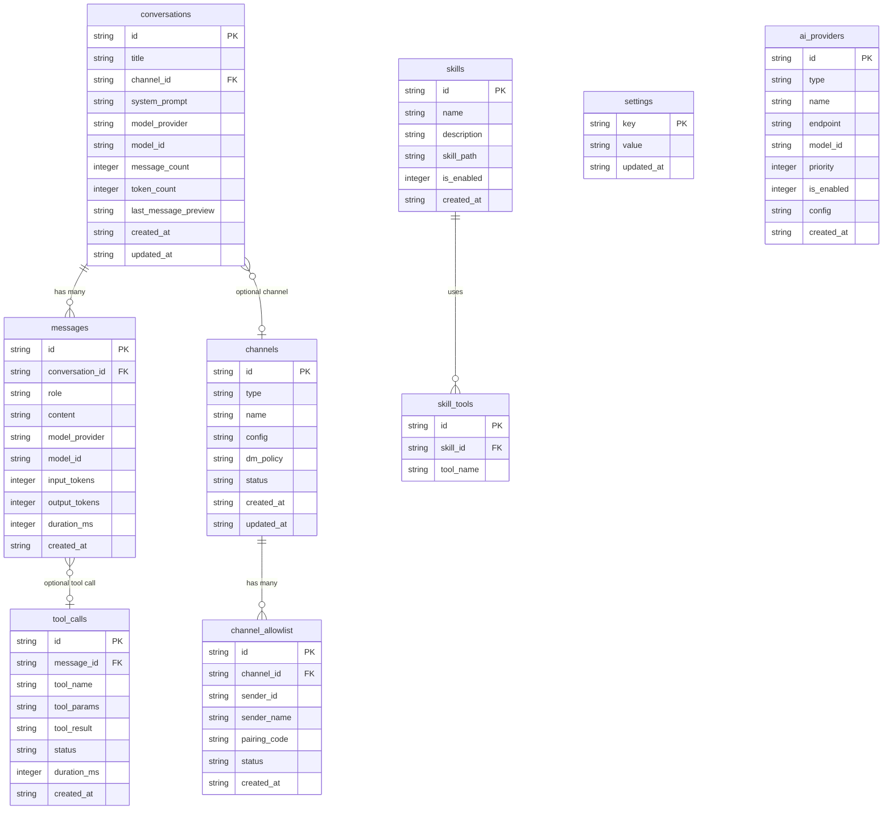

---
tags:
  - 데이터베이스
  - Room
관련:
  - "[[02_시스템_아키텍처]]"
  - "[[04_기능_요구사항]]"
---

# 05. 데이터베이스 설계

> **최종 업데이트**: 2026-04

---

## 📊 ERD (Entity Relationship Diagram)



---

## 📋 테이블 정의

### conversations — 대화 세션

| 컬럼 | 타입 | 필수 | 설명 |
|---|---|---|---|
| `id` | TEXT (UUID) | PK | 대화 고유 ID |
| `title` | TEXT | - | 대화 제목 (자동 생성 또는 사용자 설정) |
| `channel_id` | TEXT | FK | 연결된 채널 (NULL = 앱 내 직접 대화) |
| `system_prompt` | TEXT | - | 이 대화에 적용된 시스템 프롬프트 |
| `model_provider` | TEXT | - | 사용 중인 AI 프로바이더 ID |
| `model_id` | TEXT | - | 사용 중인 모델 ID |
| `message_count` | INTEGER | ✅ | 메시지 수 (캐시) |
| `token_count` | INTEGER | ✅ | 총 토큰 사용량 |
| `last_message_preview` | TEXT | - | 마지막 메시지 미리보기 (목록 표시용) |
| `is_archived` | INTEGER | ✅ | 0=활성, 1=보관 |
| `created_at` | TEXT (ISO) | ✅ | 생성 시각 |
| `updated_at` | TEXT (ISO) | ✅ | 최종 업데이트 시각 |

**인덱스**: `idx_conversations_updated` (updated_at DESC), `idx_conversations_channel` (channel_id)

### messages — 메시지

| 컬럼 | 타입 | 필수 | 설명 |
|---|---|---|---|
| `id` | TEXT (UUID) | PK | 메시지 고유 ID |
| `conversation_id` | TEXT | FK | 소속 대화 |
| `role` | TEXT | ✅ | `user` / `assistant` / `system` / `tool` |
| `content` | TEXT | ✅ | 메시지 내용 |
| `model_provider` | TEXT | - | 응답 생성한 프로바이더 (`assistant` 역할) |
| `model_id` | TEXT | - | 응답 생성한 모델 |
| `input_tokens` | INTEGER | - | 입력 토큰 수 |
| `output_tokens` | INTEGER | - | 출력 토큰 수 |
| `duration_ms` | INTEGER | - | 생성 소요 시간 (ms) |
| `created_at` | TEXT (ISO) | ✅ | 생성 시각 |

**인덱스**: `idx_messages_conversation` (conversation_id, created_at ASC)
**FTS**: `messages_fts` (content) — 대화 전문 검색

### tool_calls — 도구 호출 기록

| 컬럼 | 타입 | 필수 | 설명 |
|---|---|---|---|
| `id` | TEXT (UUID) | PK | 호출 고유 ID |
| `message_id` | TEXT | FK | 이 도구를 호출한 AI 메시지 |
| `tool_name` | TEXT | ✅ | 도구 이름 (`browser`, `calendar` 등) |
| `tool_params` | TEXT (JSON) | ✅ | 도구 파라미터 |
| `tool_result` | TEXT | - | 도구 실행 결과 |
| `status` | TEXT | ✅ | `pending` / `success` / `error` |
| `duration_ms` | INTEGER | - | 실행 소요 시간 |
| `created_at` | TEXT (ISO) | ✅ | 호출 시각 |

### channels — 채널 설정

| 컬럼 | 타입 | 필수 | 설명 |
|---|---|---|---|
| `id` | TEXT (UUID) | PK | 채널 고유 ID |
| `type` | TEXT | ✅ | `telegram` / `discord` / `slack` / `gateway` |
| `name` | TEXT | ✅ | 표시 이름 |
| `config` | TEXT (JSON) | ✅ | 채널별 설정 (bot_token, server_url 등) |
| `dm_policy` | TEXT | ✅ | `pairing` / `open` / `closed` |
| `system_prompt` | TEXT | - | 채널별 커스텀 시스템 프롬프트 |
| `model_provider` | TEXT | - | 채널별 AI 프로바이더 (NULL = 기본) |
| `model_id` | TEXT | - | 채널별 모델 (NULL = 기본) |
| `status` | TEXT | ✅ | `connected` / `disconnected` / `error` |
| `created_at` | TEXT (ISO) | ✅ | 생성 시각 |
| `updated_at` | TEXT (ISO) | ✅ | 최종 업데이트 시각 |

### channel_allowlist — 채널 허용 사용자

| 컬럼 | 타입 | 필수 | 설명 |
|---|---|---|---|
| `id` | TEXT (UUID) | PK | 항목 ID |
| `channel_id` | TEXT | FK | 소속 채널 |
| `sender_id` | TEXT | ✅ | 채널 내 사용자 식별자 |
| `sender_name` | TEXT | - | 사용자 표시 이름 |
| `pairing_code` | TEXT | - | 페어링 코드 (인증 전) |
| `status` | TEXT | ✅ | `pending` / `approved` / `blocked` |
| `created_at` | TEXT (ISO) | ✅ | 생성 시각 |

### ai_providers — AI 프로바이더 설정

| 컬럼 | 타입 | 필수 | 설명 |
|---|---|---|---|
| `id` | TEXT | PK | 프로바이더 ID (`gemini-nano`, `gemini-cloud` 등) |
| `type` | TEXT | ✅ | `nano` / `gemini` / `openai` / `ollama` / `custom` |
| `name` | TEXT | ✅ | 표시 이름 |
| `endpoint` | TEXT | - | API 엔드포인트 URL |
| `model_id` | TEXT | - | 기본 모델 ID (`gemini-2.5-pro` 등) |
| `priority` | INTEGER | ✅ | 폴백 우선순위 (1=최우선) |
| `is_enabled` | INTEGER | ✅ | 0=비활성, 1=활성 |
| `config` | TEXT (JSON) | - | 추가 설정 (temperature, max_tokens 등) |
| `created_at` | TEXT (ISO) | ✅ | 생성 시각 |

> [!warning] API 키는 이 테이블에 저장하지 않음
> API 키는 별도 `EncryptedSharedPreferences`에 `{provider_id}_api_key` 형태로 저장.

### skills — 등록된 스킬

| 컬럼 | 타입 | 필수 | 설명 |
|---|---|---|---|
| `id` | TEXT | PK | 스킬 ID |
| `name` | TEXT | ✅ | 스킬 이름 |
| `description` | TEXT | - | 스킬 설명 |
| `skill_path` | TEXT | ✅ | SKILL.md 파일 경로 |
| `is_enabled` | INTEGER | ✅ | 0=비활성, 1=활성 |
| `created_at` | TEXT (ISO) | ✅ | 등록 시각 |

### settings — 앱 설정 (Key-Value)

| 컬럼 | 타입 | 필수 | 설명 |
|---|---|---|---|
| `key` | TEXT | PK | 설정 키 |
| `value` | TEXT | ✅ | 설정 값 |
| `updated_at` | TEXT (ISO) | ✅ | 최종 업데이트 |

---

## 🔧 Room Entity 예시

```java
@Entity(tableName = "messages")
public class MessageEntity {
    @PrimaryKey
    @NonNull
    private String id;

    @ColumnInfo(name = "conversation_id")
    private String conversationId;

    private String role;          // "user", "assistant", "system", "tool"
    private String content;

    @ColumnInfo(name = "model_provider")
    @Nullable
    private String modelProvider;

    @ColumnInfo(name = "model_id")
    @Nullable
    private String modelId;

    @ColumnInfo(name = "input_tokens")
    @Nullable
    private Integer inputTokens;

    @ColumnInfo(name = "output_tokens")
    @Nullable
    private Integer outputTokens;

    @ColumnInfo(name = "duration_ms")
    @Nullable
    private Integer durationMs;

    @ColumnInfo(name = "created_at")
    private String createdAt;

    public MessageEntity() {
        this.id = UUID.randomUUID().toString();
    }

    // Getters and Setters ...
}
```

```java
@Dao
public interface MessageDao {
    @Query("SELECT * FROM messages WHERE conversation_id = :convId ORDER BY created_at ASC")
    Flowable<List<MessageEntity>> getMessages(String convId);

    @Insert
    Completable insert(MessageEntity message);

    @Query("DELETE FROM messages WHERE conversation_id = :convId")
    Completable deleteByConversation(String convId);

    // FTS 검색
    @Query("SELECT * FROM messages WHERE id IN (SELECT rowid FROM messages_fts WHERE messages_fts MATCH :query)")
    Flowable<List<MessageEntity>> search(String query);
}
```

---

## 🔗 연관 문서

- [[02_시스템_아키텍처]] — 전체 구조
- [[04_기능_요구사항]] — 기능 명세
- [[06_AI_프로바이더_설계]] — AI 프로바이더 데이터 관리

### 스택: #데이터베이스 #Room #SQLite #ERD
