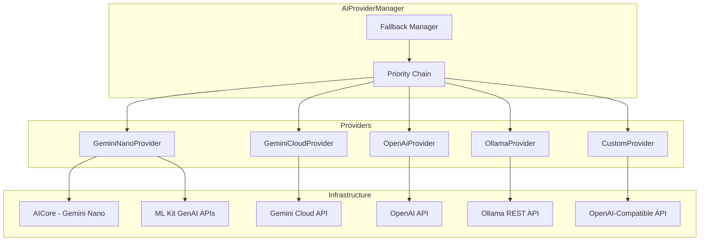

---
tags:
  - AI
  - GeminiNano
  - 프로바이더
관련:
  - "[[02_시스템_아키텍처]]"
  - "[[03_기술_스택]]"
---

# 06. AI 프로바이더 설계

> **최종 업데이트**: 2026-04

---

## 🗺️ AI 프로바이더 아키텍처



---

## 🎯 핵심 인터페이스

### AiProvider — 프로바이더 인터페이스

```java
public interface AiProvider {
    String getId();
    String getName();
    ProviderType getType();  // NANO, GEMINI, OPENAI, OLLAMA, CUSTOM

    /** 프로바이더가 현재 사용 가능한지 확인 */
    Single<Boolean> isAvailable();

    /** 텍스트 생성 (일괄) */
    Single<AiResponse> generate(AiRequest request);

    /** 텍스트 생성 (스트리밍) */
    Observable<String> generateStream(AiRequest request);

    /** 지원하는 모델 목록 */
    Single<List<ModelInfo>> listModels();
}

public enum ProviderType { NANO, GEMINI, OPENAI, OLLAMA, CUSTOM }
```

### AiRequest — 요청 데이터

```java
public class AiRequest {
    private final List<AiMessage> messages;
    private final String modelId;
    private final AiConfig config;
    private final List<ToolDefinition> tools;

    public AiRequest(List<AiMessage> messages, String modelId,
                     AiConfig config, List<ToolDefinition> tools) {
        this.messages = messages;
        this.modelId = modelId;
        this.config = config != null ? config : new AiConfig();
        this.tools = tools;
    }

    // Getters ...
}

public class AiMessage {
    private final String role;     // "system", "user", "assistant", "tool"
    private final String content;
    private final List<byte[]> images;  // 멀티모달

    public AiMessage(String role, String content, List<byte[]> images) {
        this.role = role;
        this.content = content;
        this.images = images;
    }

    // Getters ...
}

public class AiConfig {
    private float temperature = 0.7f;
    private float topP = 0.95f;
    private int topK = 40;
    private int maxOutputTokens = 4096;
    private List<String> stopSequences;

    // Getters / Setters ...
}
```

### AiResponse — 응답 데이터

```java
public class AiResponse {
    private final String content;
    private final String modelProvider;
    private final String modelId;
    private final Integer inputTokens;
    private final Integer outputTokens;
    private final Long durationMs;
    private final List<ToolCall> toolCalls;
    private final String finishReason;

    // Constructor, Getters ...
}
```

---

## 🔄 AiProviderManager — 폴백 체인 관리

```java
public class AiProviderManager {
    private final Map<String, AiProvider> providers;
    private final SettingsRepository settingsRepository;

    @Inject
    public AiProviderManager(Map<String, AiProvider> providers,
                             SettingsRepository settingsRepository) {
        this.providers = providers;
        this.settingsRepository = settingsRepository;
    }

    /**
     * 우선순위대로 프로바이더를 시도하여 응답 생성.
     * 1. 사용자 지정 프로바이더
     * 2. Gemini Nano (온디바이스)
     * 3. 설정된 클라우드 프로바이더
     * 4. 에러 반환
     */
    public Observable<String> generateStream(AiRequest request) {
        return buildProviderChain()
            .flatMapObservable(chain -> tryProviders(chain, request));
    }

    private Single<List<AiProvider>> buildProviderChain() {
        return settingsRepository.getEnabledProviders()
            .map(enabledProviders -> {
                enabledProviders.sort(Comparator.comparingInt(p -> p.getPriority()));
                List<AiProvider> chain = new ArrayList<>();
                for (var p : enabledProviders) {
                    AiProvider provider = providers.get(p.getId());
                    if (provider != null) chain.add(provider);
                }
                return chain;
            });
    }

    private Observable<String> tryProviders(List<AiProvider> chain, AiRequest request) {
        if (chain.isEmpty()) {
            return Observable.error(
                new AiProviderException("사용 가능한 AI 프로바이더가 없습니다."));
        }
        AiProvider first = chain.get(0);
        List<AiProvider> rest = chain.subList(1, chain.size());
        return first.isAvailable()
            .flatMapObservable(available -> {
                if (available) {
                    return first.generateStream(request);
                } else {
                    return tryProviders(rest, request);
                }
            });
    }
}
```

---

## 🧩 프로바이더 구현 상세

### 1. GeminiNanoProvider — 온디바이스 AI

```java
public class GeminiNanoProvider implements AiProvider {
    private final Context context;
    private GenerativeModel inferenceClient;

    @Inject
    public GeminiNanoProvider(@ApplicationContext Context context) {
        this.context = context;
    }

    @Override
    public String getId() { return "gemini-nano"; }

    @Override
    public String getName() { return "Gemini Nano (온디바이스)"; }

    @Override
    public ProviderType getType() { return ProviderType.NANO; }

    @Override
    public Single<Boolean> isAvailable() {
        return Single.fromCallable(() -> GenerativeModel.isAvailable(context));
    }

    @Override
    public Observable<String> generateStream(AiRequest request) {
        return Observable.create(emitter -> {
            GenerativeModel model = getOrCreateModel();
            String prompt = buildPromptForNano(request);

            model.generateContentStream(prompt, new StreamCallback() {
                @Override
                public void onChunk(String text) {
                    if (text != null && !emitter.isDisposed()) {
                        emitter.onNext(text);
                    }
                }

                @Override
                public void onComplete() {
                    if (!emitter.isDisposed()) emitter.onComplete();
                }

                @Override
                public void onError(Exception e) {
                    if (!emitter.isDisposed()) emitter.onError(e);
                }
            });
        });
    }

    private String buildPromptForNano(AiRequest request) {
        // Gemini Nano는 컨텍스트가 짧으므로 최근 메시지만 포함
        String systemPrompt = "";
        for (AiMessage msg : request.getMessages()) {
            if ("system".equals(msg.getRole())) {
                systemPrompt = msg.getContent();
                break;
            }
        }

        List<AiMessage> recentMessages = request.getMessages().stream()
            .filter(m -> !"system".equals(m.getRole()))
            .collect(Collectors.toList());
        int start = Math.max(0, recentMessages.size() - 10);
        recentMessages = recentMessages.subList(start, recentMessages.size());

        StringBuilder sb = new StringBuilder();
        if (!systemPrompt.isEmpty()) {
            sb.append("Instructions: ").append(systemPrompt).append("\n\n");
        }
        for (AiMessage msg : recentMessages) {
            sb.append(msg.getRole()).append(": ").append(msg.getContent()).append("\n");
        }
        return sb.toString();
    }
}
```

**특징**:
- 100% 오프라인 동작
- 무료 (API 키 불필요)
- 짧은 컨텍스트 윈도우 → 최근 메시지만 포함
- 멀티모달: ML Kit 이미지 설명 API 활용 가능
- 지원 기기 필요 (Pixel 8 Pro+, Samsung S24+)

### 2. GeminiCloudProvider — Google AI SDK

```java
public class GeminiCloudProvider implements AiProvider {
    private final EncryptedSharedPreferences encPrefs;

    @Inject
    public GeminiCloudProvider(EncryptedSharedPreferences encPrefs) {
        this.encPrefs = encPrefs;
    }

    @Override
    public String getId() { return "gemini-cloud"; }

    @Override
    public String getName() { return "Gemini (Cloud)"; }

    @Override
    public ProviderType getType() { return ProviderType.GEMINI; }

    @Override
    public Single<Boolean> isAvailable() {
        return Single.fromCallable(() ->
            encPrefs.getString("gemini-cloud_api_key", null) != null);
    }

    @Override
    public Observable<String> generateStream(AiRequest request) {
        return Observable.create(emitter -> {
            String apiKey = encPrefs.getString("gemini-cloud_api_key", null);
            if (apiKey == null) {
                emitter.onError(new AiProviderException(
                    "Gemini API 키가 설정되지 않았습니다."));
                return;
            }

            String modelName = request.getModelId() != null
                ? request.getModelId() : "gemini-2.5-flash";

            GenerationConfig config = new GenerationConfig.Builder()
                .setTemperature(request.getConfig().getTemperature())
                .setTopP(request.getConfig().getTopP())
                .setTopK(request.getConfig().getTopK())
                .setMaxOutputTokens(request.getConfig().getMaxOutputTokens())
                .build();

            GenerativeModel model = new GenerativeModel(modelName, apiKey, config);

            // 스트리밍 생성
            model.generateContentStream(buildContent(request), new StreamCallback() {
                @Override
                public void onChunk(String text) {
                    if (text != null && !emitter.isDisposed()) {
                        emitter.onNext(text);
                    }
                }

                @Override
                public void onComplete() {
                    if (!emitter.isDisposed()) emitter.onComplete();
                }

                @Override
                public void onError(Exception e) {
                    if (!emitter.isDisposed()) emitter.onError(e);
                }
            });
        });
    }
}
```

**지원 모델**: `gemini-2.5-pro`, `gemini-2.5-flash`, `gemini-2.0-flash`
**무료 티어**: Google AI Studio 무료 사용 가능 (제한 있음)

### 3. OpenAiProvider — OpenAI API

```java
public class OpenAiProvider implements AiProvider {
    private final OkHttpClient httpClient;
    private final EncryptedSharedPreferences encPrefs;
    private final Gson gson;

    @Inject
    public OpenAiProvider(OkHttpClient httpClient,
                          EncryptedSharedPreferences encPrefs, Gson gson) {
        this.httpClient = httpClient;
        this.encPrefs = encPrefs;
        this.gson = gson;
    }

    @Override
    public String getId() { return "openai"; }

    @Override
    public String getName() { return "OpenAI"; }

    @Override
    public ProviderType getType() { return ProviderType.OPENAI; }

    @Override
    public Observable<String> generateStream(AiRequest request) {
        return Observable.create(emitter -> {
            String apiKey = encPrefs.getString("openai_api_key", null);
            if (apiKey == null) {
                emitter.onError(new AiProviderException(
                    "OpenAI API 키가 설정되지 않았습니다."));
                return;
            }

            RequestBody body = RequestBody.create(
                MediaType.parse("application/json"),
                gson.toJson(buildOpenAiRequest(request)));

            Request httpRequest = new Request.Builder()
                .url("https://api.openai.com/v1/chat/completions")
                .addHeader("Authorization", "Bearer " + apiKey)
                .post(body)
                .build();

            // SSE 스트리밍 파싱
            EventSource.Factory factory = EventSources.createFactory(httpClient);
            factory.newEventSource(httpRequest, new EventSourceListener() {
                @Override
                public void onEvent(EventSource es, String id,
                                    String type, String data) {
                    String delta = parseContentDelta(data);
                    if (delta != null && !emitter.isDisposed()) {
                        emitter.onNext(delta);
                    }
                }

                @Override
                public void onClosed(EventSource es) {
                    if (!emitter.isDisposed()) emitter.onComplete();
                }
            });
        });
    }
}
```

### 4. OllamaProvider — 로컬 Ollama 서버

```java
public class OllamaProvider implements AiProvider {
    private final OkHttpClient httpClient;
    private final SettingsRepository settingsRepository;
    private final Gson gson;

    @Inject
    public OllamaProvider(OkHttpClient httpClient,
                          SettingsRepository settingsRepository, Gson gson) {
        this.httpClient = httpClient;
        this.settingsRepository = settingsRepository;
        this.gson = gson;
    }

    @Override
    public String getId() { return "ollama"; }

    @Override
    public String getName() { return "Ollama (로컬)"; }

    @Override
    public ProviderType getType() { return ProviderType.OLLAMA; }

    @Override
    public Single<Boolean> isAvailable() {
        return settingsRepository.getOllamaEndpoint()
            .flatMap(endpoint -> {
                if (endpoint == null) return Single.just(false);
                Request request = new Request.Builder()
                    .url(endpoint + "/api/tags")
                    .build();
                try (Response response = httpClient.newCall(request).execute()) {
                    return Single.just(response.isSuccessful());
                } catch (Exception e) {
                    return Single.just(false);
                }
            });
    }

    @Override
    public Single<List<ModelInfo>> listModels() {
        return settingsRepository.getOllamaEndpoint()
            .flatMap(endpoint -> {
                if (endpoint == null) return Single.just(Collections.emptyList());
                Request request = new Request.Builder()
                    .url(endpoint + "/api/tags")
                    .build();
                try (Response response = httpClient.newCall(request).execute()) {
                    OllamaModelsResponse models = gson.fromJson(
                        response.body().string(), OllamaModelsResponse.class);
                    List<ModelInfo> result = new ArrayList<>();
                    for (var m : models.getModels()) {
                        result.add(new ModelInfo(m.getName(), m.getName(), m.getSize()));
                    }
                    return Single.just(result);
                }
            });
    }
}
```

**사용 시나리오**: 같은 WiFi 네트워크의 PC에서 Ollama 실행 → 앱에서 `192.168.x.x:11434` 입력

### 5. CustomProvider — OpenAI-Compatible 엔드포인트

- LM Studio, vLLM, text-generation-webui 등 호환
- 사용자가 URL + API 키 직접 입력
- OpenAI API 형식으로 통신

---

## 🔧 PromptBuilder — 프롬프트 구성 엔진

```java
public class PromptBuilder {
    private final MessageRepository messageRepository;
    private final SkillLoader skillLoader;

    @Inject
    public PromptBuilder(MessageRepository messageRepository,
                         SkillLoader skillLoader) {
        this.messageRepository = messageRepository;
        this.skillLoader = skillLoader;
    }

    public Single<AiRequest> build(
            String conversationId,
            String userMessage,
            String systemPrompt,
            List<Tool> tools,
            int maxContextTokens) {
        return Single.fromCallable(() -> {
            // 1. 시스템 프롬프트 구성
            String system = buildSystemPrompt(systemPrompt, tools);

            // 2. 대화 히스토리 로드 (토큰 제한 내)
            List<AiMessage> history = loadContextWindow(
                conversationId, maxContextTokens);

            // 3. 메시지 리스트 조합
            List<AiMessage> messages = new ArrayList<>();
            messages.add(new AiMessage("system", system, null));
            messages.addAll(history);
            messages.add(new AiMessage("user", userMessage, null));

            List<ToolDefinition> toolDefs = null;
            if (tools != null) {
                toolDefs = new ArrayList<>();
                for (Tool t : tools) {
                    toolDefs.add(t.toDefinition());
                }
            }

            return new AiRequest(messages, null, new AiConfig(), toolDefs);
        });
    }

    private List<AiMessage> loadContextWindow(
            String conversationId, int maxTokens) {
        List<MessageEntity> allMessages =
            messageRepository.getMessagesSync(conversationId);
        // 최신 메시지부터 토큰 계산하며 역순으로 추가
        int tokenCount = 0;
        List<AiMessage> result = new ArrayList<>();
        for (int i = allMessages.size() - 1; i >= 0; i--) {
            MessageEntity msg = allMessages.get(i);
            tokenCount += estimateTokens(msg.getContent());
            if (tokenCount > maxTokens) break;
            result.add(0, new AiMessage(
                msg.getRole(), msg.getContent(), null));
        }
        return result;
    }
}
```

---

## 📊 프로바이더 비교

| 항목 | Gemini Nano | Gemini Cloud | OpenAI | Ollama | Custom |
|---|---|---|---|---|---|
| **오프라인** | ✅ | ❌ | ❌ | ⚠️ 로컬 | ❌ |
| **비용** | 무료 | 무료/유료 | 유료 | 무료 | 다양 |
| **컨텍스트** | 짧음 | 1M 토큰 | 128K | 모델별 | 모델별 |
| **속도** | 빠름 | 보통 | 보통 | 느림~보통 | 다양 |
| **품질** | 보통 | 높음 | 높음 | 모델별 | 다양 |
| **멀티모달** | 이미지 설명 | 이미지+비디오 | 이미지 | 모델별 | 모델별 |
| **Function Calling** | 프롬프트 파싱 | 네이티브 | 네이티브 | 모델별 | 모델별 |
| **지원 기기** | 제한 | 모두 | 모두 | 모두 | 모두 |

---

## 🔗 연관 문서

- [[02_시스템_아키텍처]] — 전체 아키텍처
- [[03_기술_스택]] — AI 관련 기술 스택
- [[04_기능_요구사항]] — F02 AI 모델 관리
- [[08_도구_스킬_시스템]] — Function Calling 연동

### 스택: #AI #GeminiNano #프로바이더 #멀티모델 #FunctionCalling
