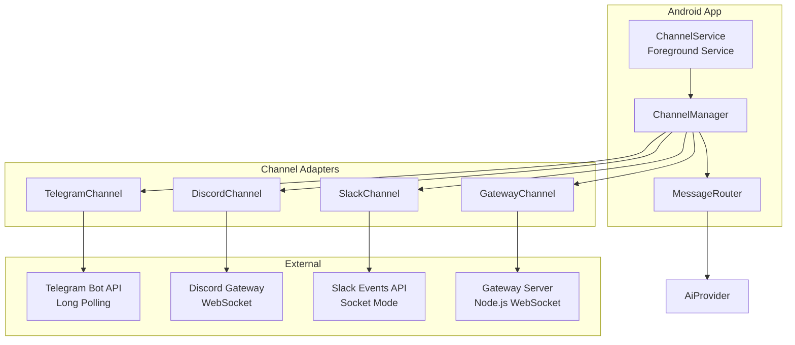
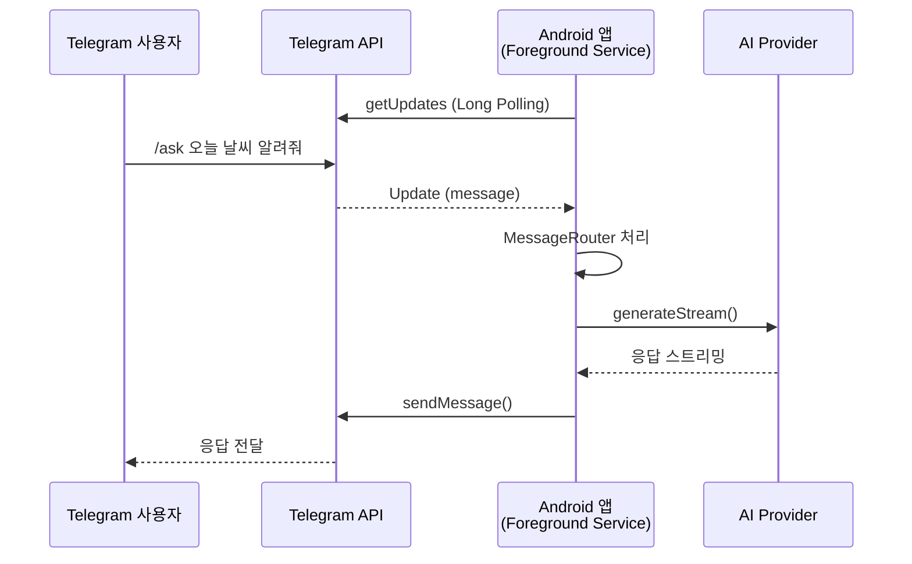
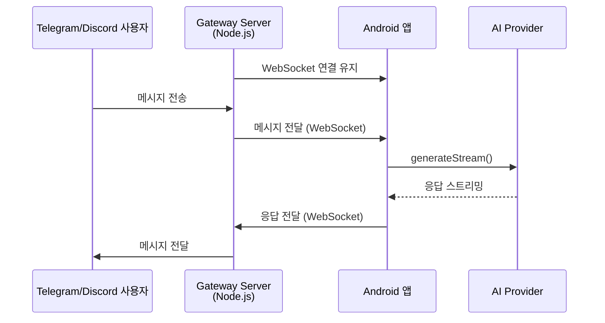
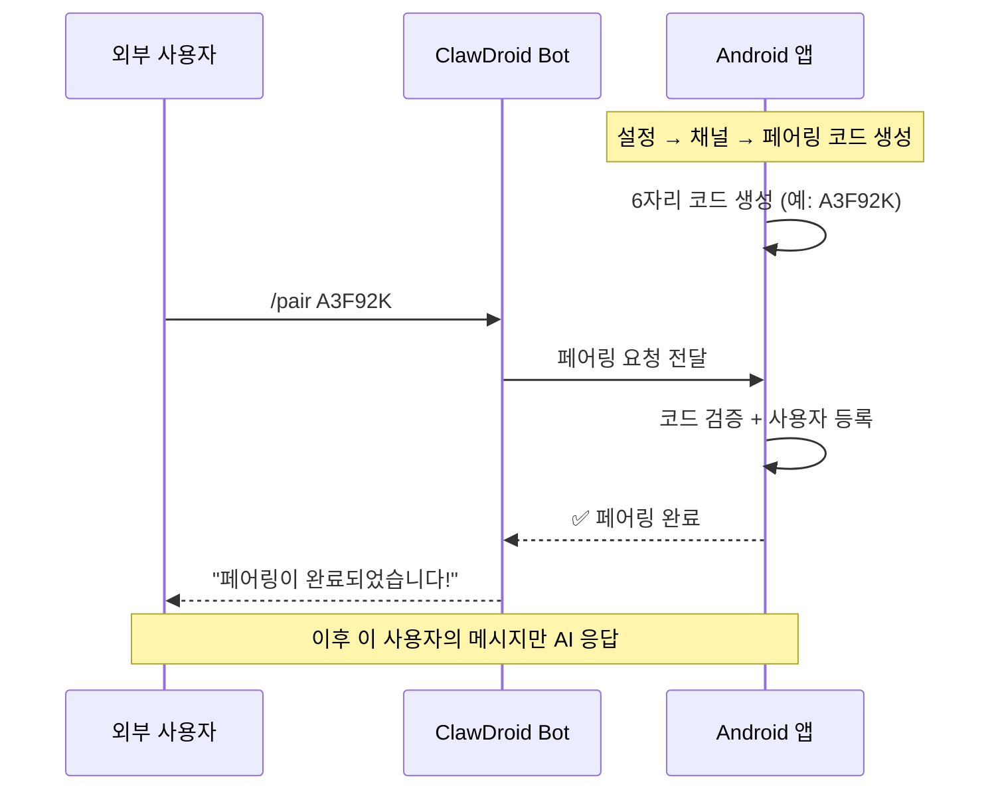

---
tags:
  - 채널
  - Telegram
  - Discord
  - Slack
관련:
  - "[[02_시스템_아키텍처]]"
  - "[[04_기능_요구사항]]"
---

# 07. 채널 연동 설계

> **최종 업데이트**: 2026-04

---

## 🗺️ 채널 시스템 아키텍처



---

## 🎯 핵심 인터페이스

### Channel — 채널 인터페이스

```java
public interface Channel {
    String getId();
    ChannelType getType();
    LiveData<ChannelStatus> getStatus();

    /** 채널 연결 시작 */
    Completable connect();

    /** 채널 연결 해제 */
    Completable disconnect();

    /** 메시지 전송 */
    Completable sendMessage(OutboundMessage message);

    /** 수신 메시지 스트림 */
    Observable<InboundMessage> incomingMessages();
}

public enum ChannelType { TELEGRAM, DISCORD, SLACK, GATEWAY }
public enum ChannelStatus { CONNECTING, CONNECTED, DISCONNECTED, ERROR }
```

### InboundMessage / OutboundMessage

```java
public class InboundMessage {
    private final String channelId;
    private final String senderId;         // 채널 내 사용자 ID
    private final String senderName;
    private final String content;
    private final List<byte[]> images;
    private final String replyToId;
    private final long timestamp;

    public InboundMessage(String channelId, String senderId,
                          String senderName, String content,
                          List<byte[]> images, String replyToId) {
        this.channelId = channelId;
        this.senderId = senderId;
        this.senderName = senderName;
        this.content = content;
        this.images = images;
        this.replyToId = replyToId;
        this.timestamp = System.currentTimeMillis();
    }

    // Getters ...
}

public class OutboundMessage {
    private final String channelId;
    private final String targetId;         // 채널 내 대상 ID (채팅방/DM)
    private final String content;
    private final String replyToId;

    // Constructor, Getters ...
}
```

---

## 📱 Standalone 모드 vs Gateway 모드

### Standalone 모드 (앱 직접 연결)



**장점**: 추가 서버 불필요, 완전 자급자족
**단점**: 앱이 켜져 있어야 함, 배터리 소모, Android 백그라운드 제한

### Gateway 모드 (중계 서버 경유)



**장점**: 안정적인 연결, 앱 오프라인 시 큐잉 가능, 다중 채널 한 번에 관리
**단점**: 서버 필요 (VPS/Raspberry Pi/Cloudflare Worker)

---

## 🔧 채널별 구현 상세

### 1. Telegram — Long Polling

```java
public class TelegramChannel implements Channel {
    private final String botToken;
    private final OkHttpClient httpClient;
    private final Gson gson;
    private final MutableLiveData<ChannelStatus> statusLiveData =
        new MutableLiveData<>(ChannelStatus.DISCONNECTED);
    private volatile boolean running = false;

    public TelegramChannel(String botToken, OkHttpClient httpClient, Gson gson) {
        this.botToken = botToken;
        this.httpClient = httpClient;
        this.gson = gson;
    }

    @Override
    public ChannelType getType() { return ChannelType.TELEGRAM; }

    @Override
    public LiveData<ChannelStatus> getStatus() { return statusLiveData; }

    @Override
    public Completable connect() {
        return Completable.fromAction(() -> {
            statusLiveData.postValue(ChannelStatus.CONNECTING);
            running = true;
            startPolling();
            statusLiveData.postValue(ChannelStatus.CONNECTED);
        });
    }

    private void startPolling() {
        long offset = 0;
        while (running) {
            Request request = new Request.Builder()
                .url("https://api.telegram.org/bot" + botToken
                    + "/getUpdates?offset=" + offset + "&timeout=30")
                .build();
            try (Response response = httpClient.newCall(request).execute()) {
                TelegramUpdates updates = gson.fromJson(
                    response.body().string(), TelegramUpdates.class);
                for (TelegramUpdate update : updates.getResult()) {
                    offset = update.getUpdateId() + 1;
                    processUpdate(update);
                }
            } catch (IOException e) {
                // 재시도 로직
            }
        }
    }

    @Override
    public Completable sendMessage(OutboundMessage message) {
        return Completable.fromAction(() -> {
            String json = gson.toJson(new TelegramSendRequest(
                message.getTargetId(), message.getContent(),
                message.getReplyToId()));
            RequestBody body = RequestBody.create(
                MediaType.parse("application/json"), json);
            Request request = new Request.Builder()
                .url("https://api.telegram.org/bot" + botToken + "/sendMessage")
                .post(body)
                .build();
            httpClient.newCall(request).execute();
        });
    }
}
```

**설정 항목**: Bot Token (BotFather에서 발급)

### 2. Discord — WebSocket Gateway

```java
public class DiscordChannel implements Channel {
    private final String botToken;
    private final OkHttpClient httpClient;
    private final Gson gson;
    private WebSocket webSocket;

    public DiscordChannel(String botToken, OkHttpClient httpClient, Gson gson) {
        this.botToken = botToken;
        this.httpClient = httpClient;
        this.gson = gson;
    }

    @Override
    public ChannelType getType() { return ChannelType.DISCORD; }

    @Override
    public Completable connect() {
        return Completable.fromAction(() -> {
            statusLiveData.postValue(ChannelStatus.CONNECTING);

            // Discord Gateway WebSocket 연결
            Request httpRequest = new Request.Builder()
                .url("https://discord.com/api/v10/gateway")
                .build();
            String gatewayUrl;
            try (Response response = httpClient.newCall(httpRequest).execute()) {
                DiscordGateway gateway = gson.fromJson(
                    response.body().string(), DiscordGateway.class);
                gatewayUrl = gateway.getUrl();
            }

            Request wsRequest = new Request.Builder()
                .url(gatewayUrl + "/?v=10&encoding=json")
                .build();

            webSocket = httpClient.newWebSocket(wsRequest, new WebSocketListener() {
                @Override
                public void onMessage(WebSocket ws, String text) {
                    processGatewayEvent(text);
                }

                @Override
                public void onOpen(WebSocket ws, Response response) {
                    // IDENTIFY payload 전송
                    ws.send(buildIdentifyPayload());
                    statusLiveData.postValue(ChannelStatus.CONNECTED);
                }
            });
        });
    }
}
```

**설정 항목**: Bot Token (Discord Developer Portal), 서버 ID, 채널 ID

### 3. Slack — Socket Mode

```java
public class SlackChannel implements Channel {
    private final String appToken;
    private final String botToken;
    private final OkHttpClient httpClient;
    private final Gson gson;

    public SlackChannel(String appToken, String botToken,
                        OkHttpClient httpClient, Gson gson) {
        this.appToken = appToken;
        this.botToken = botToken;
        this.httpClient = httpClient;
        this.gson = gson;
    }

    @Override
    public ChannelType getType() { return ChannelType.SLACK; }

    @Override
    public Completable connect() {
        return Completable.fromAction(() -> {
            // Socket Mode로 WebSocket URL 획득
            RequestBody body = RequestBody.create(
                MediaType.parse("application/json"), "");
            Request httpRequest = new Request.Builder()
                .url("https://slack.com/api/apps.connections.open")
                .addHeader("Authorization", "Bearer " + appToken)
                .post(body)
                .build();

            String wsUrl;
            try (Response response = httpClient.newCall(httpRequest).execute()) {
                SlackConnectionResponse conn = gson.fromJson(
                    response.body().string(), SlackConnectionResponse.class);
                wsUrl = conn.getUrl();
            }

            // WebSocket으로 이벤트 수신
            Request wsRequest = new Request.Builder().url(wsUrl).build();
            httpClient.newWebSocket(wsRequest, new WebSocketListener() {
                @Override
                public void onMessage(WebSocket ws, String text) {
                    processSlackEvent(text);
                }
            });
        });
    }
}
```

**설정 항목**: App Token, Bot Token, Signing Secret

---

## 🔒 DM 페어링 시스템

외부 채널에서 누구나 봇에 메시지를 보낼 수 있으므로, **허용된 사용자만 응답**하는 페어링 시스템을 구현.



### 정책 옵션

| 정책 | 설명 | 사용 사례 |
|---|---|---|
| `pairing` | 페어링 코드로 승인된 사용자만 응답 | **기본값** — 개인 사용 |
| `open` | 누구나 메시지 전송 가능 | 데모/공개 봇 |
| `closed` | 모든 외부 메시지 무시 | 유지보수 모드 |

---

## ⚡ ChannelService — Foreground Service

```java
@AndroidEntryPoint
public class ChannelService extends LifecycleService {

    @Inject ChannelManager channelManager;
    @Inject AiProviderManager aiProviderManager;

    private final CompositeDisposable disposables = new CompositeDisposable();

    @Override
    public void onCreate() {
        super.onCreate();
        startForeground(NOTIFICATION_ID, createNotification());

        disposables.add(
            channelManager.connectAll()
                .subscribeOn(Schedulers.io())
                .subscribe()
        );

        // 수신 메시지 처리
        disposables.add(
            channelManager.allIncomingMessages()
                .subscribeOn(Schedulers.io())
                .subscribe(pair -> {
                    Channel channel = pair.first;
                    InboundMessage message = pair.second;
                    handleIncomingMessage(channel, message);
                })
        );
    }

    private void handleIncomingMessage(Channel channel, InboundMessage message) {
        // 1. 허용된 사용자인지 확인
        if (!isAllowed(channel, message.getSenderId())) return;

        // 2. 대화 세션 찾기 또는 생성
        Conversation conversation =
            findOrCreateConversation(channel, message.getSenderId());

        // 3. AI 응답 생성
        disposables.add(
            aiProviderManager.generate(
                    promptBuilder.build(conversation.getId(), message.getContent()))
                .subscribe(response -> {
                    // 4. 응답 전송
                    channel.sendMessage(new OutboundMessage(
                        channel.getId(),
                        message.getSenderId(),
                        response.getContent(),
                        null
                    )).subscribe();
                })
        );
    }

    @Override
    public void onDestroy() {
        disposables.clear();
        super.onDestroy();
    }
}
```

**알림 유형**: Ongoing Notification (연결 상태 표시, 연결된 채널 수)

---

## 📊 채널별 비교

| 항목 | Telegram | Discord | Slack | Gateway |
|---|---|---|---|---|
| **연결 방식** | Long Polling | WebSocket | Socket Mode | WebSocket |
| **설정 난이도** | ⭐ 쉬움 | ⭐⭐ 보통 | ⭐⭐⭐ 어려움 | ⭐⭐ 보통 |
| **비용** | 무료 | 무료 | 무료 (제한) | 서버비 |
| **미디어** | 사진/파일 | 사진/파일 | 사진/파일 | 텍스트 |
| **그룹 지원** | ✅ | ✅ | ✅ | ❌ |
| **DM 지원** | ✅ | ✅ | ✅ | N/A |
| **배터리** | 보통 | 높음 | 높음 | 낮음 |

---

## 🔗 연관 문서

- [[02_시스템_아키텍처]] — 전체 아키텍처
- [[04_기능_요구사항]] — F04 멀티채널
- [[05_데이터베이스_설계]] — channels, channel_allowlist 테이블
- [[08_도구_스킬_시스템]] — 채널 경유 도구 호출

### 스택: #채널 #Telegram #Discord #Slack #Gateway #WebSocket
