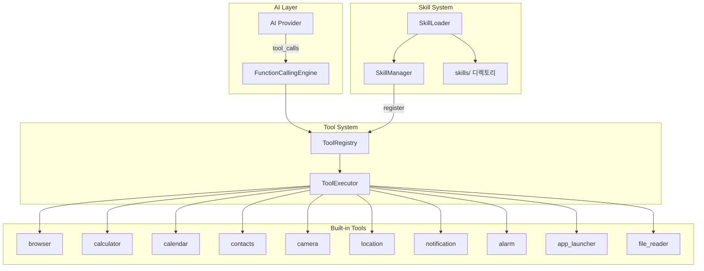
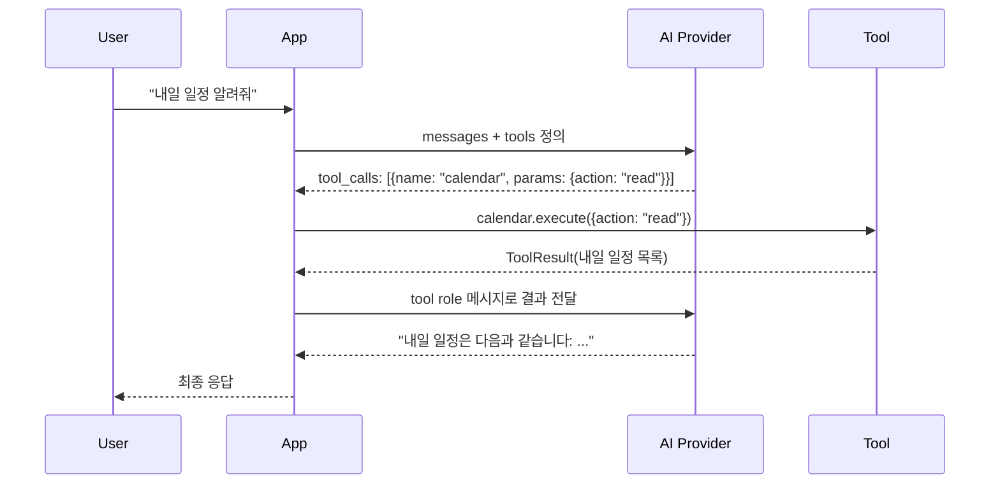
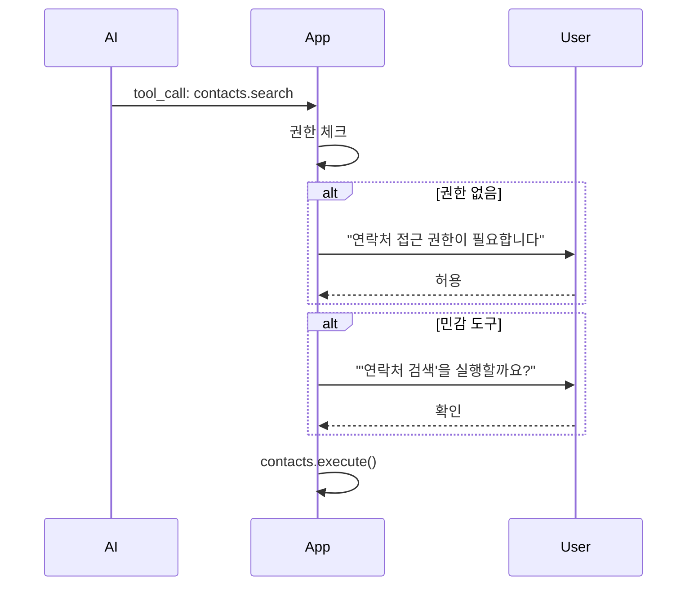

---
tags:
  - 도구
  - 스킬
  - FunctionCalling
관련:
  - "[[04_기능_요구사항]]"
  - "[[06_AI_프로바이더_설계]]"
---

# 08. 도구 · 스킬 시스템

> **최종 업데이트**: 2026-04

---

## 🗺️ 도구 · 스킬 시스템 아키텍처



---

## 🔧 도구(Tool) 인터페이스

### Tool — 기본 인터페이스

```java
public interface Tool {
    /** 도구 고유 이름 */
    String getName();

    /** 도구 설명 (AI가 참조) */
    String getDescription();

    /** JSON Schema 형태의 파라미터 정의 */
    JsonObject getParameters();

    /** 권한 요구사항 */
    default List<String> getRequiredPermissions() {
        return Collections.emptyList();
    }

    /** 도구 실행 */
    Single<ToolResult> execute(JsonObject params);
}

public class ToolResult {
    private final boolean success;
    private final String data;
    private final String error;

    public ToolResult(boolean success, String data, String error) {
        this.success = success;
        this.data = data;
        this.error = error;
    }

    // Getters ...
}
```

### ToolDefinition — AI에게 전달하는 도구 정의

```java
public class ToolDefinition {
    private final String name;
    private final String description;
    private final JsonObject parameters;  // JSON Schema

    // Constructor, Getters ...
}

// Gemini Cloud / OpenAI 네이티브 Function Calling 형식
// Gemini Nano는 프롬프트 기반 파싱
```

---

## 📋 내장 도구 목록

| 도구 | 이름 | 설명 | 필요 권한 |
|---|---|---|---|
| 🌐 | `browser` | 웹 검색 및 페이지 요약 | `INTERNET` |
| 🧮 | `calculator` | 수학 계산 | — |
| 📅 | `calendar` | 일정 조회/추가 | `READ_CALENDAR`, `WRITE_CALENDAR` |
| 👥 | `contacts` | 연락처 검색 | `READ_CONTACTS` |
| 📷 | `camera` | 사진 촬영 | `CAMERA` |
| 📍 | `location` | 현재 위치 조회 | `ACCESS_FINE_LOCATION` |
| 🔔 | `notification` | 알림 생성 | `POST_NOTIFICATIONS` |
| ⏰ | `alarm` | 알람/타이머 설정 | `SET_ALARM` |
| 📱 | `app_launcher` | 앱 실행 | — |
| 📄 | `file_reader` | 파일 읽기 | `READ_EXTERNAL_STORAGE` |

### 도구 구현 예시: browser

```java
public class BrowserTool implements Tool {
    private final OkHttpClient httpClient;

    @Inject
    public BrowserTool(OkHttpClient httpClient) {
        this.httpClient = httpClient;
    }

    @Override
    public String getName() { return "browser"; }

    @Override
    public String getDescription() {
        return "웹 페이지를 검색하거나 URL의 내용을 요약합니다.";
    }

    @Override
    public JsonObject getParameters() {
        JsonObject params = new JsonObject();
        params.addProperty("type", "object");
        JsonObject properties = new JsonObject();

        JsonObject query = new JsonObject();
        query.addProperty("type", "string");
        query.addProperty("description", "검색할 키워드 또는 URL");
        properties.add("query", query);

        JsonObject action = new JsonObject();
        action.addProperty("type", "string");
        JsonArray enumValues = new JsonArray();
        enumValues.add("search");
        enumValues.add("fetch");
        action.add("enum", enumValues);
        action.addProperty("description", "search: 웹 검색, fetch: URL 내용 가져오기");
        properties.add("action", action);

        params.add("properties", properties);
        JsonArray required = new JsonArray();
        required.add("query");
        required.add("action");
        params.add("required", required);
        return params;
    }

    @Override
    public Single<ToolResult> execute(JsonObject params) {
        return Single.fromCallable(() -> {
            String queryStr = params.has("query")
                ? params.get("query").getAsString() : null;
            if (queryStr == null) {
                return new ToolResult(false, "", "query 필수");
            }
            String actionStr = params.has("action")
                ? params.get("action").getAsString() : "search";

            switch (actionStr) {
                case "search": return webSearch(queryStr);
                case "fetch":  return fetchUrl(queryStr);
                default: return new ToolResult(
                    false, "", "알 수 없는 action: " + actionStr);
            }
        });
    }
}
```

### 도구 구현 예시: calendar

```java
public class CalendarTool implements Tool {
    private final Context context;

    @Inject
    public CalendarTool(@ApplicationContext Context context) {
        this.context = context;
    }

    @Override
    public String getName() { return "calendar"; }

    @Override
    public String getDescription() {
        return "캘린더에서 일정을 조회하거나 새 일정을 추가합니다.";
    }

    @Override
    public List<String> getRequiredPermissions() {
        return Arrays.asList(
            Manifest.permission.READ_CALENDAR,
            Manifest.permission.WRITE_CALENDAR
        );
    }

    @Override
    public Single<ToolResult> execute(JsonObject params) {
        return Single.fromCallable(() -> {
            String action = params.has("action")
                ? params.get("action").getAsString() : "read";
            switch (action) {
                case "read":   return readEvents(params);
                case "create": return createEvent(params);
                default: return new ToolResult(
                    false, "", "알 수 없는 action");
            }
        });
    }

    private ToolResult readEvents(JsonObject params) {
        Cursor cursor = context.getContentResolver().query(
            CalendarContract.Events.CONTENT_URI,
            PROJECTION,
            CalendarContract.Events.DTSTART + " >= ?",
            new String[]{ String.valueOf(System.currentTimeMillis()) },
            CalendarContract.Events.DTSTART + " ASC"
        );
        // 결과를 JSON 문자열로 반환
        String events = parseCursor(cursor);
        return new ToolResult(true, events, null);
    }
}
```

---

## ⚡ FunctionCallingEngine

AI 프로바이더에 따라 Function Calling 방식이 다름.

### Gemini Cloud / OpenAI — 네이티브 Function Calling



### Gemini Nano — 프롬프트 기반 파싱

Gemini Nano는 네이티브 Function Calling을 지원하지 않으므로, **프롬프트 엔지니어링**으로 구현.

```java
public class NanoFunctionCallingParser {
    private final Gson gson;

    public NanoFunctionCallingParser(Gson gson) {
        this.gson = gson;
    }

    /**
     * Gemini Nano의 응답에서 도구 호출 지시를 파싱.
     *
     * 프롬프트에 다음 형식을 지시:
     * <tool_call>
     * {"name": "calendar", "params": {"action": "read", "date": "2026-04-15"}}
     * </tool_call>
     */
    public ParsedResponse parse(String response) {
        Pattern pattern = Pattern.compile(
            "<tool_call>\\s*(\\{.*?\\})\\s*</tool_call>",
            Pattern.DOTALL);
        Matcher matcher = pattern.matcher(response);

        List<ToolCallRequest> toolCalls = new ArrayList<>();
        while (matcher.find()) {
            try {
                ToolCallRequest call = gson.fromJson(
                    matcher.group(1), ToolCallRequest.class);
                toolCalls.add(call);
            } catch (Exception e) {
                // 파싱 실패 매치 무시
            }
        }

        String textContent = pattern.matcher(response)
            .replaceAll("").trim();

        return new ParsedResponse(textContent, toolCalls);
    }
}
```

**시스템 프롬프트 예시** (Nano용):
```
당신은 ClawDroid 개인 AI 비서입니다.
사용 가능한 도구:
- calendar: 일정 조회/추가. params: {action: "read"|"create", date?: string, title?: string}
- browser: 웹 검색. params: {query: string, action: "search"|"fetch"}

도구가 필요하면 다음 형식으로 응답:
<tool_call>
{"name": "도구이름", "params": {파라미터}}
</tool_call>
```

---

## 🎭 스킬(Skill) 시스템

### Skill 디렉토리 구조

```
/sdcard/ClawDroid/skills/
├── weather/
│   ├── SKILL.md
│   └── config.json
├── translator/
│   ├── SKILL.md
│   └── config.json
└── homeassistant/
    ├── SKILL.md
    └── config.json
```

### SKILL.md 포맷

```markdown
---
name: weather
description: 날씨 정보를 조회하는 스킬
version: 1.0.0
author: user
tools:
  - get_weather
  - get_forecast
---

# Weather Skill

현재 날씨와 예보를 조회합니다.

## 도구

### get_weather
- **설명**: 특정 지역의 현재 날씨
- **파라미터**:
  - `city` (string, 필수): 도시 이름
- **엔드포인트**: GET https://api.openweathermap.org/data/2.5/weather

### get_forecast
- **설명**: 5일 예보
- **파라미터**:
  - `city` (string, 필수): 도시 이름
- **엔드포인트**: GET https://api.openweathermap.org/data/2.5/forecast

## 시스템 프롬프트 확장
날씨를 물어보면 get_weather 도구를 사용하세요.
온도는 섭씨로 표시하세요.
```

### SkillLoader

```java
public class SkillLoader {
    private final Context context;
    private final File skillsDir;

    @Inject
    public SkillLoader(@ApplicationContext Context context) {
        this.context = context;
        this.skillsDir = new File(
            Environment.getExternalStorageDirectory(), "ClawDroid/skills");
    }

    public List<Skill> loadAll() {
        if (!skillsDir.exists()) return Collections.emptyList();

        File[] dirs = skillsDir.listFiles(File::isDirectory);
        if (dirs == null) return Collections.emptyList();

        List<Skill> skills = new ArrayList<>();
        for (File dir : dirs) {
            File skillMd = new File(dir, "SKILL.md");
            if (skillMd.exists()) {
                Skill skill = parseSkill(dir, skillMd);
                if (skill != null) skills.add(skill);
            }
        }
        return skills;
    }

    private Skill parseSkill(File dir, File file) {
        try {
            String content = new String(
                Files.readAllBytes(file.toPath()), StandardCharsets.UTF_8);
            Map<String, Object> frontMatter = parseFrontMatter(content);
            String body = extractBody(content);

            return new Skill(
                (String) frontMatter.get("name"),
                (String) frontMatter.get("name"),
                (String) frontMatter.get("description"),
                (String) frontMatter.get("version"),
                parseSkillTools(body),
                extractSystemPrompt(body),
                dir
            );
        } catch (IOException e) {
            return null;
        }
    }
}
```

---

## 🔐 보안 고려사항

### 도구 실행 보안

| 위험 | 대응 |
|---|---|
| 프롬프트 인젝션으로 도구 남용 | 민감 도구(contacts, camera)는 매번 사용자 확인 요청 |
| 무한 도구 호출 루프 | 대화당 최대 도구 호출 횟수 제한 (기본 10회) |
| 외부 스킬 악성 코드 | 스킬은 API 호출만 가능, 시스템 명령 실행 불가 |
| 과도한 API 호출 | 도구별 레이트 리밋 설정 |

### 권한 요청 플로우



---

## 🔗 연관 문서

- [[04_기능_요구사항]] — F05 도구 시스템, F06 스킬 시스템
- [[06_AI_프로바이더_설계]] — Function Calling 연동
- [[05_데이터베이스_설계]] — tool_calls, skills 테이블

### 스택: #도구 #스킬 #FunctionCalling #프롬프트엔지니어링
