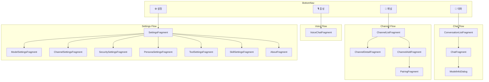

---
tags:
  - UI
  - XMLViews
  - Material3
관련:
  - "[[02_시스템_아키텍처]]"
  - "[[04_기능_요구사항]]"
---

# 09. UI · 화면 설계

> **최종 업데이트**: 2026-04

---

## 🗺️ 네비게이션 구조



---

## 📱 화면별 설계

### 1. ConversationListFragment — 대화 목록

```
┌──────────────────────────────┐
│ 🐾 ClawDroid          🔍  ➕ │
├──────────────────────────────┤
│ ┌──────────────────────────┐ │
│ │ 📌 코딩 도우미           │ │
│ │ React 컴포넌트 만들어... │ │
│ │ gemini-nano · 5분 전     │ │
│ └──────────────────────────┘ │
│ ┌──────────────────────────┐ │
│ │ 💬 일상 대화             │ │
│ │ 내일 날씨 알려줘...      │ │
│ │ gemini-2.5-flash · 1시간 │ │
│ └──────────────────────────┘ │
│ ┌──────────────────────────┐ │
│ │ 📡 Telegram · John       │ │
│ │ Thanks for the help!     │ │
│ │ openai · 3시간 전        │ │
│ └──────────────────────────┘ │
│                              │
│                              │
├──────────────────────────────┤
│ 💬    🎙️    📡    ⚙️       │
└──────────────────────────────┘
```

**기능**:
- **새 대화**: FAB 또는 상단 + 버튼
- **대화 검색**: 상단 🔍 → FTS 전문 검색
- **대화 카드**: 제목, 마지막 메시지 미리보기, 사용 모델, 시간
- **스와이프**: ItemTouchHelper로 왼쪽 = 보관, 오른쪽 = 삭제
- **롱프레스**: 제목 변경, 모델 변경, 핀 고정
- **채널 표시**: 채널 라벨이 있으면 해당 채널 경유 대화 표시

### 2. ChatFragment — 채팅

```
┌──────────────────────────────┐
│ ← 코딩 도우미  gemini-nano ▾ │
├──────────────────────────────┤
│                              │
│     ┌──────────────────┐     │
│     │ React로 카운터    │     │
│     │ 컴포넌트 만들어줘 │     │
│     └──────────────────┘     │
│                              │
│ ┌────────────────────────┐   │
│ │ 네, React 카운터를     │   │
│ │ 만들어 드릴게요!       │   │
│ │                        │   │
│ │ ```jsx                 │   │
│ │ function Counter() {   │   │
│ │   const [count, set... │   │
│ │ ```                    │   │
│ │                        │   │
│ │ 🔧 도구: calculator ✅ │   │
│ │ ⏱️ 1.2s · 342 tokens  │   │
│ └────────────────────────┘   │
│                              │
├──────────────────────────────┤
│ 📎 🎙️ [메시지 입력      ] ➤ │
└──────────────────────────────┘
```

**기능**:
- **스트리밍 응답**: 토큰 단위 실시간 표시
- **마크다운 렌더링**: 코드 블록 (구문 강조), 테이블, 리스트
- **모델 전환**: 상단 모델 이름 탭 → DialogFragment로 모델 선택
- **도구 호출 표시**: 인라인 칩으로 도구 이름 + 상태 (pending/success/error)
- **메시지 액션**: 롱프레스 → 복사, 재생성, 공유
- **입력**: 텍스트 + 이미지 첨부(📎) + 음성 입력(🎙️)
- **토큰/시간 표시**: 각 AI 응답 하단에 소형 텍스트

### 3. VoiceChatFragment — 음성 대화

```
┌──────────────────────────────┐
│ ← 음성 대화                  │
├──────────────────────────────┤
│                              │
│                              │
│         ╭──────────╮         │
│         │          │         │
│         │  🎙️     │         │
│         │          │         │
│         ╰──────────╯         │
│                              │
│      "듣고 있습니다..."      │
│                              │
│  ┌────────────────────────┐  │
│  │ 사용자: 내일 일정 알려줘│  │
│  │                        │  │
│  │ AI: 내일은 오전 10시에 │  │
│  │ 회의가 있고...         │  │
│  └────────────────────────┘  │
│                              │
│    ╭────╮  ╭────╮  ╭────╮   │
│    │ ⏹️ │  │ 🎙️ │  │ ⚙️ │   │
│    ╰────╯  ╰────╯  ╰────╯   │
└──────────────────────────────┘
```

**기능**:
- **Push-to-Talk**: 버튼을 누르고 있는 동안 녹음
- **Hands-free**: 웨이크 워드 감지 → 자동 녹음 시작
- **음성 시각화**: 녹음 중 파형(Waveform) 애니메이션
- **실시간 STT**: ML Kit GenAI Speech Recognition으로 변환
- **TTS 재생**: Android TTS 또는 ElevenLabs로 응답 읽기
- **대화 기록**: 하단에 스크롤 가능한 텍스트 기록 표시

### 4. ChannelListFragment — 채널 목록

```
┌──────────────────────────────┐
│ 📡 채널                   ➕ │
├──────────────────────────────┤
│ ┌──────────────────────────┐ │
│ │ 🔵 Telegram Bot          │ │
│ │ ● 연결됨 · 2명 등록     │ │
│ │ 마지막 메시지: 3분 전    │ │
│ └──────────────────────────┘ │
│ ┌──────────────────────────┐ │
│ │ 🟣 Discord Bot           │ │
│ │ ● 연결됨 · 1개 서버     │ │
│ │ 마지막 메시지: 1시간 전  │ │
│ └──────────────────────────┘ │
│ ┌──────────────────────────┐ │
│ │ ⬜ Slack Bot              │ │
│ │ ○ 연결 안 됨             │ │
│ │                          │ │
│ └──────────────────────────┘ │
│                              │
├──────────────────────────────┤
│ 💬    🎙️    📡    ⚙️       │
└──────────────────────────────┘
```

### 5. SettingsFragment — 설정

```
┌──────────────────────────────┐
│ ⚙️ 설정                     │
├──────────────────────────────┤
│                              │
│ 🤖 AI 모델                  │
│ ├─ 기본 모델: Gemini Nano   │
│ ├─ 클라우드 API 키 관리     │
│ └─ 폴백 순서 설정           │
│                              │
│ 📡 채널                     │
│ ├─ Telegram 설정            │
│ ├─ Discord 설정             │
│ └─ Gateway 설정             │
│                              │
│ 🔧 도구 · 스킬              │
│ ├─ 내장 도구 관리           │
│ └─ 스킬 관리                │
│                              │
│ 🎭 페르소나                  │
│ ├─ 시스템 프롬프트           │
│ └─ 이름 · 성격 설정         │
│                              │
│ 🔒 보안                     │
│ ├─ 앱 잠금 (생체/PIN)      │
│ └─ 대화 암호화              │
│                              │
│ ℹ️ 정보                     │
│ └─ 버전 · 라이센스          │
│                              │
├──────────────────────────────┤
│ 💬    🎙️    📡    ⚙️       │
└──────────────────────────────┘
```

---

## 🎨 디자인 시스템

### 색상 테마

| 요소 | Light | Dark |
|---|---|---|
| Primary | `#6750A4` (보라) | `#D0BCFF` |
| Secondary | `#625B71` | `#CCC2DC` |
| Tertiary | `#7D5260` | `#EFB8C8` |
| Surface | `#FEF7FF` | `#1D1B20` |
| User Bubble | `#E8DEF8` | `#4A4458` |
| AI Bubble | `#F3EDF7` | `#2B2930` |
| Online | `#4CAF50` | `#81C784` |
| Error | `#B3261E` | `#F2B8B5` |

> Material 3 Dynamic Color 지원 — 배경화면 기반 자동 색상 추출

### 타이포그래피

| 용도 | 스타일 | 크기 |
|---|---|---|
| 화면 제목 | `titleLarge` | 22sp |
| 대화 제목 | `titleMedium` | 16sp |
| 메시지 본문 | `bodyLarge` | 16sp |
| 코드 블록 | `JetBrains Mono` | 14sp |
| 메타 정보 | `labelSmall` | 11sp |

### 컴포넌트

| 컴포넌트 | Material 3 위젯 |
|---|---|
| 하단 네비게이션 | `BottomNavigationView` |
| 대화 카드 | `MaterialCardView` |
| 모델 선택 | `BottomSheetDialogFragment` |
| 설정 그룹 | `PreferenceFragmentCompat` |
| 도구 상태 칩 | `Chip` (Material) |
| 입력 필드 | `TextInputEditText` + `TextInputLayout` |
| 스트리밍 인디케이터 | Custom 타이핑 애니메이션 |

---

## 📱 위젯 설계

### Quick Chat Widget (4×2)

```
┌──────────────────────────────┐
│ 🐾 ClawDroid                │
│ ┌────────────────────────┐   │
│ │ 무엇을 도와드릴까요?   │   │
│ └────────────────────────┘   │
│  🎙️ 음성   ⌨️ 텍스트      │
└──────────────────────────────┘
```

**기능**: 탭 → 빠른 질문 입력 → 인라인 응답 표시
**구현**: RemoteViews (XML 기반 App Widget)

### Status Widget (2×1)

```
┌──────────────┐
│ 📡 3채널 연결 │
│ 🔋 Nano 활성 │
└──────────────┘
```

---

## 🔗 연관 문서

- [[02_시스템_아키텍처]] — Navigation 구조
- [[04_기능_요구사항]] — UI 관련 요구사항
- [[03_기술_스택]] — XML Views, Material 3

### 스택: #UI #XMLViews #Material3 #Widget #Navigation
